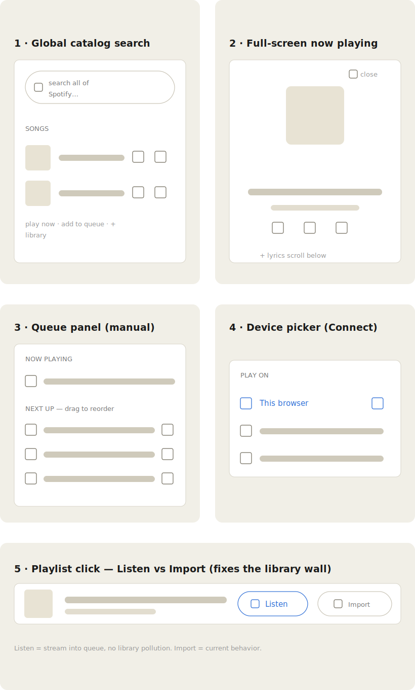

# Song Ranker — Next Update: Player Parity Plan

Goal: make Song Ranker viable as a daily Spotify-web-player replacement for the people who also rank their music. This doc holds the full roadmap plus the detailed spec for the first build item.

Last updated: 2026-06-16.

---

## 1. Target (fixed scope)

**A closed group of ≤5 Premium users who rank their music.** Not a public product. Two constraints are settled and will not change:

- **Every user has Spotify Premium** → in-app playback always works; no free-tier / degraded path to design for.
- **Never more than 5 users** → the Development-Mode cap is a non-issue (the group fits inside it); no scaling work, ever.

These remove two whole problem areas (non-Premium fallback, scaling past the cap). The remaining ceilings are product-level only: no radio, no podcasts. Frame the update as *"the primary player for the five of us who rate our music."*

## 2. The gate

Today you can only play music **already imported into your library**. A real player plays anything on demand. **Catalog search → play / queue is the single unlock.** Everything else is secondary.

Feasibility confirmed: `/search` still works (throttled to 10/page) and SDK playback via track `uris` was untouched by the 2024–2026 API cuts.

## 3. Current state

**Have (free):** shuffle, repeat, seek, volume, up-next popover, play-count tracking, per-song Play in the right-click menu, Home shelves, library search, playlist export to Spotify, cloud sync, Friends + a recommendation engine.

**Don't have:** catalog playback, add-to-queue / play-next, listen-without-import, Liked Songs / Recently-played as playable views, full-screen now-playing, manual queue reorder, device picker, lyrics, artist/album pages, autoplay continuation.

## 4. Spotify API reality + workarounds (verified June 2026)

**Dead for good — don't chase:** `recommendations`, `audio-features`, `audio-analysis`, `related-artists`, `new-releases`, `featured-playlists`, categories, 30s previews. Extended Quota is unreachable (requires a registered business + 250k monthly active users).

**The Dev-Mode limits are already satisfied by scope** (§1): the Feb 2026 change capped apps at **5 users** and made Premium mandatory for test users — both are fine here. Just add each of the ≤5 users as a test user in the Spotify dashboard once. No BYO-Client-ID, no scaling plan needed.

**Still alive and useful:** `/search`, `/artists/{id}/albums`, `/albums/{id}`, all `/me/player/*` playback + device endpoints, playlist read/create.

| Workaround | Solves | Honest caveat |
|---|---|---|
| **Rebuild dead features from owned data** (already done for top-tracks via search) | recommendations, new-releases | recs → friend recs + your Elo + play counts; new-releases → "new from your artists" via `getArtistAlbums` filtered by `release_date` |
| **Cache responses** (localStorage — lyrics/search are tiny; IndexedDB only if it grows) | 429s + the 10/page search throttle | Don't reach for IndexedDB prematurely |

**Won't work, skip:** a proxy with your own creds (the *app* is limited, not the user); scraping the web player's private API (ToS, ban risk, breaks constantly).

## 5. Synced lyrics — verified feasible, no key, no proxy

**LRCLIB.** Free, no API key, no rate limit, ~3M lyrics, returns `syncedLyrics` in LRC format (`[mm:ss.xx]`), and **CORS `access-control-allow-origin: *` confirmed** — direct fetch from the github.io page works, no proxy.

Tracking reuses what already exists: `current.position` + the `positionTimer` interpolation + `seekTo` (`player.js:200/244`). Flow: fetch by name + artist + album + **duration** (`durationMs` is stored; duration disambiguates remixes/live, ±2s) → parse LRC to `[{tMs, line}]` → each tick highlight the last line where `tMs <= position`, auto-scroll → recompute on seek. Bump the tick from 1000ms → ~250ms only while the lyrics view is open.

Fallback chain: synced → `plainLyrics` → "no lyrics" (community DB, coverage is uneven). Rejected alternatives: Genius (no timestamps), Musixmatch (paid/keyed for synced), sp_dc-cookie scrapers (fragile, ToS-gray).

## 6. Strategy — why anyone stays

Parity is the entry ticket; the **sell** is what Spotify can't do: your Elo taste graph, friend compare + recs (Spotify killed its recs API — out-discover it socially), and owned / exportable ratings. Position: **"Spotify + your taste graph."**

## 7. Roadmap (funnel, sequenced)

### Stage A — Play anything (the gate)
1. **Global catalog search → play / add-to-queue / +library** (wireframe 1). M. `searchTracks` exists; needs a results overlay. **Spec below.**
2. **Add to queue / play next.** S. Add `enqueue()` to the player queue (`player.js:17`/`176`); wire into `showSongMenu` (`main.js:212`). **Prereq for item-1's queue button.**

### Stage B — Listen freely (kill the commitment wall)
3. **Listen-vs-Import split on playlists** (wireframe 5). S. Listen = stream to queue, no library dump (today it force-imports, `main.js:202`).
4. **Liked Songs + Recently-played as playable views.** S. Data already pulled; pure render.

### Stage C — Feels like a player
5. **Manual queue reorder / remove** (wireframe 3) + **full-screen now-playing** (wireframe 2). M. `dnd.js` reusable.
6. **Autoplay continuation** (own-data "radio"): on queue end, append same-artist (search) / same group or tag / friends' top unplayed / your high-Elo unplayed. M. Legit replacement for the dead recs API.
7. **Device picker** (wireframe 4) + sleep timer + media keys (`MediaSession`). S. `getDevices` / `transferPlayback` already used internally.

### Stage D — Why stay (differentiators)
8. **Friend recs on Home** ("Because [friend] rates this high"). M. Engine already exists in `metrics.js`.
9. **Synced lyrics (LRCLIB)** in full-screen now-playing. M. See §5.
10. **Artist / album pages** ("new from your artists" shelf). M. `getArtistAlbums` / `getAlbum` live; cache + cap per-artist calls (the batch endpoint is gone).

Server footprint stays tiny: only the existing Supabase edge function; everything else is client-side.

Because all users are Premium (§1), there is **no non-Premium mode to build** — playback is always available. The only defensive case left is "SDK not ready yet" (Premium user, device still initializing), which the existing `playList` guard already covers.

**Bottom line:** Stage A + B are mostly small and reuse repo code — that's the "is it a real player" line. Stage D is the "do I stay or bounce back to Spotify" line.

## 8. Wireframes

Low-fi layout sketches for the new surfaces. Referenced inline above by number.

1. **Global catalog search** (item 1) — search overlay, result rows with play / add-to-queue / +library.
2. **Full-screen now-playing** (item 5) — large art, transport, lyrics scroll below.
3. **Queue panel** (item 5) — now-playing + drag-to-reorder next-up list.
4. **Device picker** (item 7) — Spotify Connect target list.
5. **Listen-vs-Import** (item 3) — playlist click offers stream-without-import vs the current import behavior.

---

# Spec — Stage A, Item 1: Global catalog search

## Goal & scope

A search box that hits all of Spotify (not just the library), shows track results, each row offering **Play**, **Add to queue**, **+ Library** (wireframe 1).

- **In scope:** the overlay, wiring `searchTracks`, Play (no import), + Library.
- **Out of scope:** the Add-to-queue *button only functions* once item-2 ships `enqueue()` (dependency below).
- **Do not** conflate with the existing library filter box (`views.js:27`, `st.search`) — that filters owned songs; this is a separate catalog surface.

## The one design rule that matters

**Play must bypass library ingest** — otherwise the commitment wall comes back. The overlay holds raw results in memory and converts on demand:

| Action | Path | Imports? |
|---|---|---|
| Play | `normalizeTrack(raw)` → `player.playList(records, idx)` | **No** |
| Add to queue | `normalizeTrack(raw)` → `player.enqueue(record)` *(item-2)* | No |
| + Library | `library.importSearchResults([raw])` | Yes (intended) |

All three reuse existing functions. No data-layer changes.

## Reuse (don't rebuild)

- `api.searchTracks(q, want=20)` — `api.js:67`. Returns raw Spotify track objects. 429 backoff handled in `sfetch`.
- `library.normalizeTrack(t)` — `library.js:5`. Raw → app record; returns `null` for podcasts/local files (auto-filters junk).
- `library.importSearchResults(raw[])` — `library.js:98`. Ingest + dedupe + genre enrich.
- `player.playList(items, idx)` — `player.js:176`. Plays normalized records. **Throws** if no `deviceId` (the Premium gate — reuse its message).
- `ui.openModal(html, {title, wide})` — `ui.js:6`. `ui.toast` — `ui.js:41`.

## New code (1 module + 2 wires)

**1. `js/catalog.js`** (new, ~80 lines):
- `openCatalogSearch()` — `openModal` with a text input + empty results `<ul>`.
- Input handler, **debounced 300ms**: `await searchTracks(q, 20)`, render rows. Guard empty/whitespace query.
- **Session cache**: `const cache = new Map()` keyed by lowercased query. In-memory only; don't touch localStorage.
- Row render: art + name + artists + 3 action buttons (reuse existing `.btn sm` classes).
- Delegated click on the results list → dispatch Play / Queue / + Library per the table above.
- Module-scope `let results = []` (raw) for the play-context mapping.

**2. Entry point** — a search button in the top bar calling `openCatalogSearch()`. Mirror `#btn-sort` binding (`main.js:288`). One line + one event.

**3. Player-not-ready guard** — wrap Play in try/catch, surface `e.message` via toast (same as `playFrom`, `views.js:385`). All users are Premium, so this only fires when the SDK device is still initializing — `playList` already throws the right message. No non-Premium branch needed.

## Dependency

**Add-to-queue button needs item-2 first.** The queue is private in `player.js` (`player.js:17`); no `enqueue` exists. Item-2 adds `export function enqueue(record)` that pushes to `queue` and rebuilds `order`. **Recommended order: build item-2's `enqueue()` first (~10 lines), then item-1 wires all three buttons live.** Until then, render the queue button disabled with a tooltip.

## Edge cases

- Empty / whitespace query → clear results, no fetch.
- Zero results → "No tracks found" row.
- No-uri tracks can't appear from catalog (always real uris) — keep `playList`'s existing no-uri guard anyway.
- In-flight race: tag each fetch with its query string; drop responses whose query != current input value.
- Rate-limit: `searchTracks` loops 2× (10/page) per search; debounce caps frequency.

## Test checklist

1. Type "bohemian" → results in <1s.
2. Play a result → audio starts, **song NOT added to library** (verify count unchanged).
3. + Library on a result → count +1, appears in library view.
4. Play before the SDK is ready (reload + immediate Play) → toasts the "player not ready" message, no crash.
5. Back-type the same query → no second network call (cache hit).
6. Fast-type "abc" then "abcd" → only "abcd" results render (no race flash).

## Effort

**S–M.** One new ~80-line module, two wire-ups, zero data-layer changes. Gated on item-2's `enqueue()` (~10 lines) for the queue button.

---

# Spec — Stage A, Item 2: Add to queue / play next

## Goal & scope

Let any track be appended to the live play queue without restarting playback — from the catalog overlay (item-1) and from the song right-click menu. Two flavours: **Add to queue** (end) and **Play next** (right after the current track).

## New code

**1. `player.enqueue(item, { next = false })`** — `player.js`, after `playList`:
- Guard: throw the existing "player not ready" message if no `deviceId`; throw "no playable track" if the item has no `uri`.
- **Empty queue** → delegate to `playList([item], 0)` (nothing playing, so just start it).
- **Non-empty** → `norm()` the item, push onto `queue`, then insert its index into `order`: `next` splices at `orderPos + 1`, otherwise pushes to the end. Then `syncControls(); renderQueue(); emit('player')`.
- Reuses the existing private `queue` / `order` / `norm` / `renderQueue` machinery — no queue rewrite.

**2. Wire into the song menu** — `main.js` `showSongMenu`, right after the existing Play item (only when `single?.uri`): add **Add to queue** and **Play next**, both calling a small `enqueueSong(song, next)` helper that awaits `player.enqueue` and toasts the outcome.

**3. Catalog overlay** (item-1) — the queue button calls `player.enqueue(normalizeTrack(raw))`. Now functional.

## Edge cases

- Queue already ended (paused at the end): enqueue appends; the new track plays on the next Play/Next press. Acceptable for v1 — no silent auto-resume.
- No-uri / sample tracks: guarded, toasts an error.
- Order indices stay valid: a pushed index always points at the just-pushed `queue` entry.

## Test checklist

1. Play a list, then "Add to queue" another track → it appears at the end of the up-next popover, current track keeps playing.
2. "Play next" → inserted directly after the current track.
3. "Add to queue" with nothing playing → playback starts on that track.
4. Right-click a library song → menu shows Add to queue + Play next; both work.

## Effort

**S.** ~12 lines in `player.js` + 2 menu items + a 3-line helper. No new files.
