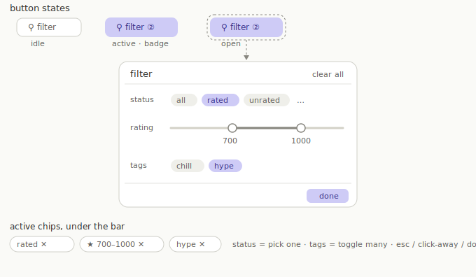

# Filter redesign — Option A (filter button + popover)

Status: built + verified in preview (2026-06-16), shipping as v1.3.0. Goal: replace the crowded filter bar with one compact, user-friendly control. Compactness is the priority (Option A won that axis).

## Visual spec

## Why

Today the library controls are split and cramped:

- Sort field + direction live in the **top bar**, away from the filters (`index.html` `.top-actions`).
- The rating range is **two tiny number inputs** (`#min-rating` / `#max-rating`).
- Status, range, and the group-by pills crowd one wrapping row, and the row wraps below ~1100px.

Measured on the live site (skin v2, sample data): sort is in `.topbar` not `#filterbar`, `#min-rating`/`#max-rating` are 64px number boxes, `#filterbar` is `flex-wrap: wrap`.

## Target layout

### Sub-bar (one row, replaces the filter bar)

Left to right:

1. **Group-by** segmented control: All / By Artist / By Genre / By Album / By Tag / My Groups (the existing `.pill-row`, kept).
2. flex spacer
3. **`↕ Sort: <field> ▾`** — one button, opens a small menu (8 fields + asc/desc toggle).
4. **`▦` layout** toggle (rows / cards / tiers), moved down from the top bar.
5. **`⚲ Filter`** button with a count badge when filters are active.

Below the bar: the **active-filter chips** row (reuses the slot where tag chips already render).

Top bar after the move keeps only: menu, brand, search, undo, Import, Connect, Settings.

### Filter popover (opens under the Filter button)

- **Header:** "Filter" + "Clear all" (Clear all shows only when something is active).
- **Status — pick one** (radio pills): All, Rated, Unrated, With notes, Tagged, Untagged, Played, Never played (today's `#rated-filter` options).
- **Rating — two-thumb slider** 1–1000 with live readouts. Replaces the number boxes. Vanilla, no dependency: two overlaid `<input type=range>`, JS clamps min <= max. Dim when status is "Unrated only".
- **Tags — toggle many** (multi-select chips), mirrors the sidebar tags.
- **Footer:** Done.

### States

- Button idle: neutral. Active (>=1 facet): accent outline + badge. Open: accent fill + popover visible.
- Close on Esc, click-outside, or Done.
- Each active facet renders as a removable chip under the bar; its ✕ clears just that facet. Clear all resets all filter facets (keeps group-by and sort).
- Badge count = status active (1) + range active (1) + any tags (1). Search is separate, not counted.

## Files to change

- `index.html` — move sort/dir/layout into the sub-bar; remove inline `#rated-filter` + `.range-filter` + `#btn-clear-filters`; add Sort button + Filter button + badge.
- `css/main.css` — sub-bar layout, Sort/Filter button + badge styles, popover positioning.
- `css/components.css` — filter popover panel, dual-range slider, active-chip styles.
- `css/skin.css` — v2 matching styles for the new controls if needed.
- `js/main.js` — rewire `bindChrome` (drop old handlers, add Filter popover + Sort menu); update `syncControls` (badge, active class, all-facet chips, sort label).
- `js/views.js` — no engine change. `visible()` already reads `search`, `filterTags`, `ratedFilter`, `minRating`, `maxRating`.
- `js/store.js` — no new persisted state. Popover-open is transient.

## Build checklist

- [x] 1. Relocate sort + direction + layout toggle from the top bar into the sub-bar.
- [x] 2. Replace the status select + range inputs + Clear with a Filter button + popover shell.
- [x] 3. Wire the popover controls (status pills, dual slider, tag chips, Clear all) to the existing settings.
- [x] 4. Add the badge + active-facet chips under the bar.
- [x] 5. Sort menu (field list + direction) behind the Sort button.
- [x] 6. States + a11y (`aria-expanded`, `is-open`/`has-filters`, Esc + outside-click close). Optional `f` shortcut + shortcuts-modal row deferred.
- [x] 7. Verified in preview (port 5510 + sample data): popover opens, status + dual slider drive filtering, badge counts, chips remove, sort menu re-sorts, Esc/outside/toggle close. `?v=` cache tags bumped (components.css v6, main.js v8). Commit still pending.

## Notes

- Cache: bump the `?v=` query on changed CSS / `main.js` in `index.html`. ES-module imports are unversioned, so module changes refresh via GitHub Pages' ~10 min TTL.
- Side win: fixes mobile, where the sort select is hidden at <=600px today. One Filter button taps open instead.

## Follow-ups (2026-06-16)

From first real-data use:

- **Tags: 5 recent + "See all".** The popover tag row was dumping every tag. Now it shows the 5 most-recently-used (`settings.recentTags` order, active tags forced visible) plus a `See all (N)` chip that opens a full-tag modal (`openTagFilterModal`). Verified live: 5 shown, modal lists all, toggling syncs `filterTags`.
- **Sub-bar auto-hide on scroll** (chosen over the scrim option). `bindBarAutoHide()` on `.main` scroll: hide on scroll-down (`bar-hidden`), reveal on scroll-up or at top; `bar-stuck` adds a frosted backdrop once scrolled so the revealed bar reads over rows. Sort/Filter buttons changed from ghost to solid so they stand out. CSS in `main.css` (`?v=4`). Decision logic validated; the live toggle is not exercisable in the headless preview (it gates `requestAnimationFrame`), but works in a real browser. Worth a real-browser scroll check before relying on it.
